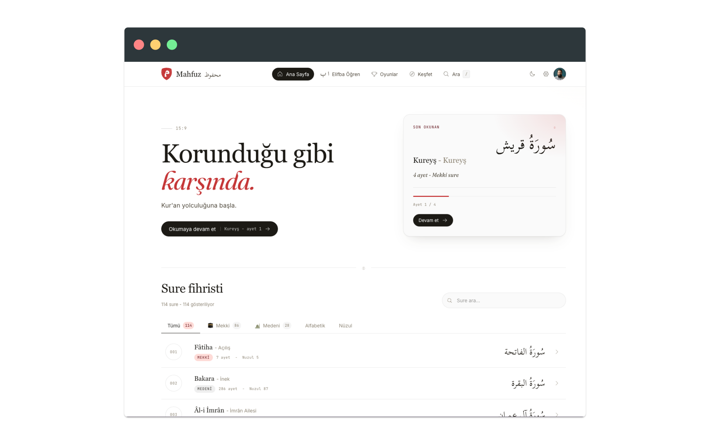
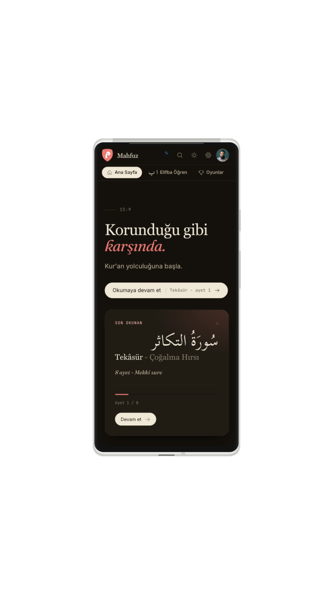

<div align="center">

<br>


# Mahfuz / محفوظ

Read, listen, learn, and memorize the Quran. Together.

**[mahfuz.ilg.az](https://mahfuz.ilg.az)**

<br>





<br>

</div>

---

## What is Mahfuz?

Mahfuz started as a simple Quran reader and grew into a full learning companion. No ads, no distractions. It is open source and free to use.

Whether you are reading for the first time or working on your hifz, Mahfuz gives you the tools without getting in the way.

## Features

### Read

- **Surah view** with verse-by-verse translations, word-by-word breakdown, and tajweed coloring
- **Mushaf page view** (604 pages) for traditional reading with keyboard and swipe navigation
- **6 Turkish translations** including Diyanet, Elmalili, Omer Celik, Omer Nasuhi Bilmen, and Ali Fikri Yavuz, plus 18 more across 19 languages
- **Two text styles**: Uthmani (Medina mushaf script) and simplified Arabic
- **Bookmarks** and reading position tracking across sessions

### Listen

- Verse-level and surah-level audio playback with word-by-word highlighting
- Multiple reciters with adjustable speed and volume
- Continuous playback across verses

### Learn

- **Alifba**: learn the 28 Arabic letters with forms, pronunciation, and finger tracing
- **Qaida**: 14-stage structured reading curriculum from letters to tajweed
- **Tajweed rules**: 17 interactive rules with examples (Madd, Idgham, Ikhfa, Izhar, Qalqala, and more)
- **Verse analysis**: side-by-side translations, morphology, themes, similar verses, and contextual explanations

### Play

Seven Quran games to test your knowledge:

- **Fill in the blank**: complete the missing word in a verse
- **Verse chain**: connect verses in the correct order
- **Surah guess**: identify the surah from a verse
- **Word meaning**: match Arabic words to their meanings
- **Hexagon**: form words from scattered letters
- **Word prediction**: guess the next word
- **Verse 2048**: merge matching verse tiles

Plus seven Alifba mini-games for letter recognition and memory. Global leaderboards and achievements.

### Together

- **Khatm groups**: create or join a group to complete the Quran together, track each member's progress
- **Personal notes** on verses
- **Hifz tracker**: mark memorized verses and see your progress per surah

### Everything else

- **3 themes**: Light, Sepia (warm), Dark, with 4 color palettes and 7 accent colors
- **19 languages** for translations, UI in Turkish, English, Spanish, French, Arabic, German, Dutch
- **55 reciters** including Mishari Rashid al-Afasy, Al-Husary, Al-Banna, and more
- **Offline support**: PWA with Service Worker caching
- **Auth**: email, Google, and Apple sign-in

## Getting Started

```bash
git clone https://github.com/theilgaz/mahfuz.git
cd mahfuz/mahfuz-app
npx pnpm@9 install
cp apps/web/.env.example apps/web/.env
npx pnpm@9 dev
```

Dev server runs at `http://localhost:3001`.

| Command | What it does |
|---------|-------------|
| `npx pnpm@9 dev` | Start dev server |
| `npx pnpm@9 build` | Production build |
| `npx pnpm@9 lint` | ESLint |
| `npx pnpm@9 typecheck` | TypeScript checking |

## Tech Stack

| | |
|---|---|
| Framework | React 19, TanStack Start (SSR), TanStack Router |
| Styling | Tailwind CSS v4 |
| State | Zustand |
| Data | TanStack Query, Drizzle ORM, LibSQL / Turso |
| Auth | Better Auth (email + Google + Apple) |
| Build | Vite 7, Turborepo, pnpm |
| Deploy | Docker (node:22-alpine), Dokploy |

## Project Structure

```
mahfuz-app/
├── apps/
│   ├── web/                 Main web app (React + TanStack Start)
│   └── mobile/              Expo mobile app (planned)
├── packages/
│   ├── shared/              Types, constants, curriculum data
│   ├── audio-engine/        Playback with word-level sync
│   ├── api/                 Quran.com API client
│   ├── gamification/        Badge and achievement system
│   └── memorization/        SM-2 spaced repetition
└── tooling/                 Shared ESLint, TypeScript, Tailwind configs
```

## Credits

### Translations

| Translation | Author |
|-------------|--------|
| Diyanet İşleri Başkanlığı Meali | Diyanet İşleri Başkanlığı |
| Elmalılı Yeni Meali | Elmalılı Hamdi Yazır (Sadeleştirilmiş) |
| Ömer Çelik Meali | Prof. Dr. Ömer Çelik |
| Ömer Nasuhi Bilmen Meali | Ömer Nasuhi Bilmen |
| Ali Fikri Yavuz Meali | Ali Fikri Yavuz |
| Muhammed Esed Meali | Muhammed Esed |

### Translations via [Açık Kuran API](https://acikkuran.com)

| Translation | Author |
|-------------|--------|
| Hayat Kitabı Kur'an | Mustafa İslamoğlu |
| Mesaj: Kuran Çevirisi | Edip Yüksel |
| Kur'an-ı Kerim Meali | Yaşar Nuri Öztürk |
| Kur'an Meal-Tefsir | Mehmet Okuyan |
| Süleymaniye Vakfı Meali | Süleymaniye Vakfı |
| Yeni Anlayışın Işığında | Bayraktar Bayraklı |
| Kur'an Çözümü | Ahmed Hulusi |
| Kur'an Mesajı | Muhammed Esed |
| Kur'an-ı Kerim ve Yüce Meali | Süleyman Ateş |
| Kur'an-ı Kerim ve Meali | Suat Yıldırım |
| Kur'an-ı Kerim ve Türkçe Anlamı | Ali Bulaç |

### Data Sources

- **[Tanzil.net](https://tanzil.net)** - Quran verse texts in Uthmani and Simple scripts. CC BY 3.0.
- **[Quran.com API](https://quran.com)** - Word-by-word data, transliteration, and translations.
- **[Açık Kuran API](https://acikkuran.com)** - Additional Turkish translations and root word analysis.
- **[Kuran Meali Ebook Oluşturucu](https://github.com/alialparslan/Kuran-Meali-Ebook-Olusturucu)** by alialparslan - Ali Fikri Yavuz and Ömer Nasuhi Bilmen translations.

### Fonts

- **[KFGQPC Uthmani Hafs](https://fonts.qurancomplex.gov.sa)** - King Fahd Glorious Quran Printing Complex.
- **[Scheherazade New](https://fonts.google.com/specimen/Scheherazade+New)** and **[Noto Naskh Arabic](https://fonts.google.com/noto/specimen/Noto+Naskh+Arabic)** from Google Fonts.

## Contributing

Contributions are welcome. Whether you work with React, care about accessibility, or want to improve translations, there is room for you here.

Open an issue first so we can talk about it, then send a pull request.

## License

MIT
